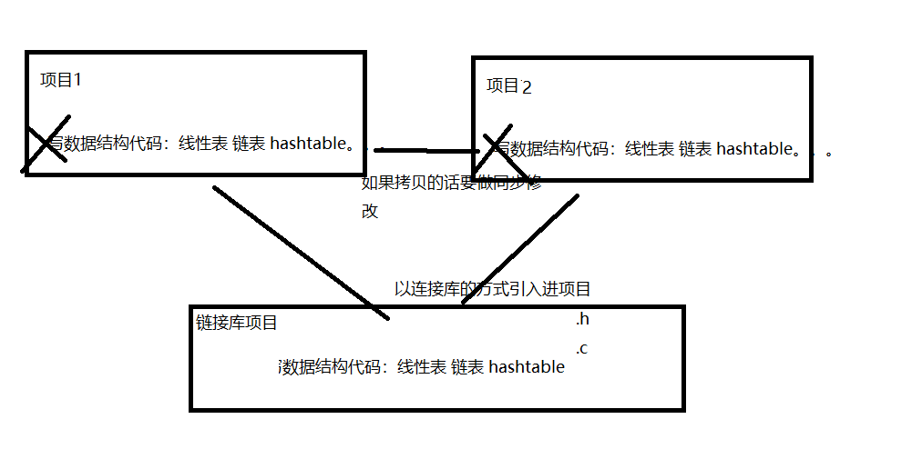
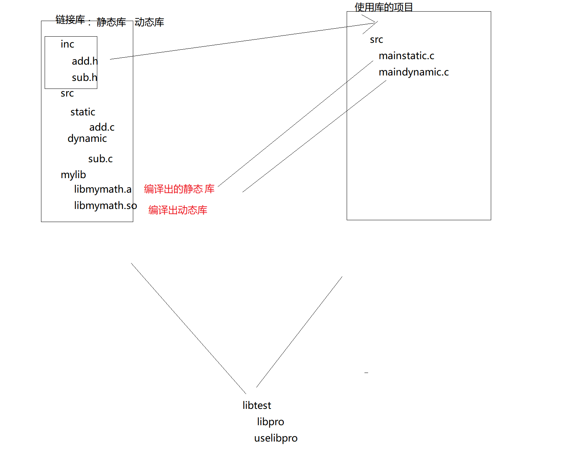
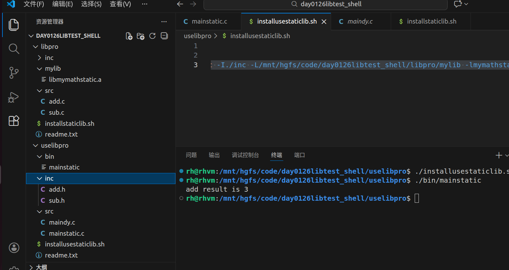
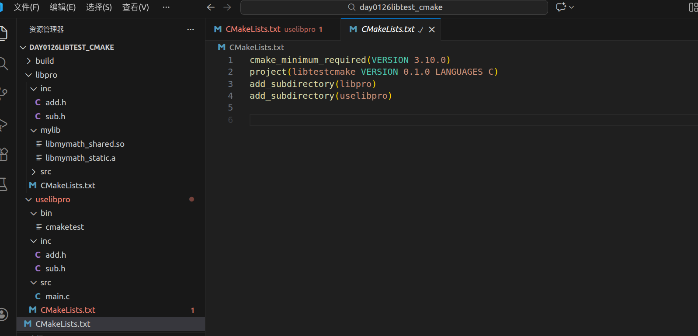

# 链接库-day1

## 一 课程简介

- 链接库概述
- 链接库使用案例-使用三方提供的链接库
- 自定义静态库-使用shell来编译
- 自定义动态库-使用shell来编译
- cmake编译库

## 二 链接库概述

### 1、为什么需要



**库文件(链接库最终编译处理的文件)的作用包括代码重用、提高程序效率、简化代码维护、便于模块化更新和跨平台开发。**

* 代码重用。库文件包含常用的函数、类或模块，可以方便地被不同的应用程序重复使用，从而减少代码量，提高代码的可维护性和复用性。
* 提高程序开发效率。库文件通常是经过高度优化和测试的，可以避免重复编写已有的功能，节省开发时间。
* 简化代码维护。将大工程划分为多个模块，每个模块作为独立的库，可以单独维护，只要库的交互头文件不改动，库内部的修改对其他部分是透明的。
* 模块化更新和跨平台开发。通过添加特定平台的库文件，可以实现跨平台的功能适配，保证程序在不同平台上的运行一致性。
* **保密**作用。库文件可以封装底层函数实体，提供给用户可执行代码的二进制形式，同时保护底层实现细节。
* 加快项目开发。通过将大工程划分为多个模块，每个模块作为独立的库，可以加快开发速度，提高开发效率。

### 2、是什么

​	库文件一般就是编译好的二进制文件，用于在链接阶段同目标代码（.o）一起生成可执行文件（静态库），或者运行可执行文件的时候被加载（动态库），以便调用库文件中的某段代码。库文件无法直接执行，因为它的源代码中没有入口主函数(main)，而只是一些函数模块的定义和实现，所以无法直接执行。链接库使程序更加模块化，重新编译更快，更新更容易。


### 3、分类

#### 3.1、静态库

在编译程序的时候静态库的内容会被完成的复制到程序的内部，

* 优点
  当我们运行该程序是不会出现缺失的问题
* 缺点
  不利于更能的更新
  需要占用更多的内存

#### 3.2、动态库

在编译的时候动态库并没被复制到程序中， 而是检查将否是否异常*（参数、返回值、函数名...）

* 优点
  相对于静态库来说占用更少的内存
  对程序执行的效率有一定的提升
  
  有利于更新
  
* 缺点
  当程序执行的时候需要有动态库的支持

### 4、命名

   在windows中链接库的名字为*.dll

* 使用lib作为前缀： 比如 libDeployPkg.so.0 / libhgfs.so.0 .....

* 静态库一般以 .a 为后缀 ， 动态库一般以.so为后缀

* 库文件会有不同的版本， 一般写在后缀后面， 比如 lib.a.so.0.1.2

  > 1. libc.so.1.0.3(标准库的支持)
  > 2. lib 库文件的前缀
  >     的名字（链接库文件时 ，只需要写上该名字）.so 后缀（so为动态库/共享库 a 则是静态库）
  > 3. 1 库文件的版本号
  > 4. 0.3 修正号

## 三   链接库使用案例-libcurl

### 1、libcurl（C 语言网络库）

#### 1.1 核心定位

`libcurl` 是一套开源、跨平台的 C 语言 API 库，专为开发者设计 —— 允许你将网络传输功能嵌入到 C/C++（或其他绑定语言）程序中，实现自动化、可编程的网络请求。

#### 1.2核心特点

- **可编程**：提供标准化 API，可集成到代码中，支持自定义逻辑（如回调处理数据）；
- **高性能**：支持异步、多线程、持久连接，适合高并发场景；
- **高可靠**：内置超时、重试、SSL/TLS 加密、错误处理机制，稳定性远超手写网络请求代码；
- **多语言绑定**：除原生 C 接口，还有 curlcpp（C++）、pycurl（Python）、php-curl 等，适配不同开发语言。

#### 1.3. 典型使用场景 & 示例（C 语言）


```
#include <stdio.h>
#include <curl/curl.h>

// 回调函数：处理服务器返回的数据
size_t write_data(void *ptr, size_t size, size_t nmemb, void *stream) {
    fwrite(ptr, size, nmemb, stdout); // 输出到控制台
    return size * nmemb;
}

int main() {
    // 1. 全局初始化
    curl_global_init(CURL_GLOBAL_DEFAULT);
    // 2. 创建curl句柄
    CURL *curl = curl_easy_init();
    
    if (curl) {
        // 3. 设置请求参数（URL、回调函数等）
        curl_easy_setopt(curl, CURLOPT_URL, "https://www.baidu.com");
        curl_easy_setopt(curl, CURLOPT_WRITEFUNCTION, write_data);
        // 4. 执行请求
        CURLcode res = curl_easy_perform(curl);
        // 5. 错误处理
        if (res != CURLE_OK) {
            fprintf(stderr, "请求失败：%s\n", curl_easy_strerror(res));
        }
        // 6. 释放句柄
        curl_easy_cleanup(curl);
    }
    // 7. 全局清理
    curl_global_cleanup();
    return 0;
}
```

**编译运行（Linux）**：

bash

```
# 安装开发依赖
sudo apt install libcurl4-openssl-dev
# 编译（-lcurl 链接libcurl库）
gcc demo.c -o demo -lcurl
# 运行
./demo
```

#### 1.4. 适用人群

C/C++ 开发人员、后端 / 嵌入式 / 移动端开发者，需要将网络请求功能集成到程序中。

### 2 使用libcurl链接库

#### 2.1 安装libcurl库到Ubuntu

```tex
	libcur库下载地址： https://github.com/curl/curl/releases/download/curl-7_87_0/curl-7.87.0.tar.bz2
   sudo tar vxf xx.bz2

   cd ...

  sudo   ./configure --without-ssl

  sudo  make

  sudo  make install

   /usr/local/lib

   /usr/local/include/curl/curl.h
  
  如果不能直接解压tar.bz结尾的文件，需要先执行下面两行命令来安装bzip
sudo apt update
sudo apt install bzip2
```


#### 2.2 普通项目使用

```c
#include "curl/curl.h"

// 回调函数：处理服务器返回的数据
size_t write_data(void *ptr, size_t size, size_t nmemb, void *stream) {
    char* content  =  (char*)ptr;
    printf("%s\r\n",content);
    return size * nmemb;
}
int main(int argc, char const *argv[])
{
    //1 curl全局初始化
    curl_global_init(CURL_GLOBAL_DEFAULT);
    //2 获取curl句柄
    CURL *curl = curl_easy_init();
    if (curl)
    {
        //3 设置发请求相关的参数 请求地址 请求方式get/post 请求回来获取返回结果的回调函数
        curl_easy_setopt(curl, CURLOPT_URL, "http://www.baidu.com");//如果没有设置请求方式默认就是get
        curl_easy_setopt(curl, CURLOPT_WRITEFUNCTION, write_data);
        //4 发请求
        CURLcode result = curl_easy_perform(curl);
        //5 判断请求是否成功
         if (result != CURLE_OK) {
            fprintf(stderr, "请求失败：%s\n", curl_easy_strerror(result));
        }
        //6 释放句柄
        curl_easy_cleanup(curl);
    }
    
    //7 全局清理
    curl_global_cleanup();
    return 0;
}

```

  

- 编译的时候指定头文件和链接库

  ```shell
  #！/bin/bash
  # -lcurl    不要前缀lib也不要后缀.so
  gcc main.c -lcurl -o main
  ```
  


#### 2.3 cmake使用


创建cmake项目，配置如下

```cmake
cmake_minimum_required(VERSION 3.10.0)
project(curlcmaketest VERSION 0.1.0 LANGUAGES C)

# 1 查找curl库
find_package(CURL REQUIRED)
# 如果找到curl库，输出信息
if(CURL_FOUND)
    message(STATUS "Found CURL: ${CURL_INCLUDE_DIRS}")
else()
    message(FATAL_ERROR "Could not find CURL library")
endif(CURL_FOUND)


# 2.设置头文件目录使得系统可以找到对应的头文件
include_directories( 
    ${CURL_INCLUDE_DIR}          #其他系统目录的头文件 也可以直接写路径/usr/include/eigen3
)


#3 链接库到目标
add_executable(curlcmaketest main.c) # 链接curl库
target_link_libraries(curlcmaketest PRIVATE ${CURL_LIBRARIES})


```


拷贝原来的代码，编译测试就OK


## 四 自定义库（shell）

### 1 项目结构

架构分析



add测试静态库

sub测试动态库


### 2 自定义静态库-shell


#### 1 编译库

##### 1.1、* 先获得.o文件

> gcc -c src/add.c -o obj/add.o -I inc

##### 1.2、* 把以上生成的两个.o文件一起编译生成静态库文件

> ar -rcs mylib/libmymathstatic.a obj/add.o 
>
> ```tex
> “ar -rcs” 是用于操作归档文件的命令，通常在 Unix、Linux 等系统中使用，主要用于创建和维护静态库文件。其中，“ar” 是归档命令，“-rcs” 是该命令的选项组合，具体含义如下：
> 
> -r：表示将指定文件追加到归档文件中。如果归档文件不存在，它会先创建该归档文件。
> -c：用于创建新的归档文件。若指定的归档文件已存在，该选项不会产生错误，只是不会再次创建。
> -s：会为归档文件写入对象文件索引，或者更新已有的索引。这有助于链接器更快地访问归档文件中的函数，相当于运行 “ranlib” 命令。
> 
> ```
>


##### 1.3 编译脚本

installstaticlib.sh

```shell
#!/bin/bash

#清除
rm -rf ./mylib/*
rm -rf ./src/*.o
#编译o文件
gcc -c ./src/add.c -I./inc  -o ./src/add.o

#形成链接库
ar -rcs mylib/libmymath.a ./src/add.o

#清除
rm -rf ./src/*.o
```


#### 2 使用库项目



​	把静态库的头文件拷贝了一份到使用库的项目。

##### 2.1 代码

mainstatic.c

```c
#include <add.h>
#include <stdio.h>
int main(int argc, char const *argv[])
{
    printf("add result is %d\r\n",add(1,2));
    return 0;
}

```

installusestaticlib.sh

```shell
#!/bin/bash
# -L链接库所在文件夹
gcc src/mainstatic.c -I./inc -L/mnt/hgfs/code/day0126libtest_shell/libpro/mylib -lmymathstatic -o bin/mainstatic
```


-lm  当时我们并没有用-L指定链接库路径？？？？ 请见下一章节


### 3 自定义动态库-shell

#### 1 编译库

##### 1.1、* 先获得.o文件


gcc -c src/sub.c -o obj/sub.o -I inc

##### 1.2、* 把以上生成的两个.o文件一起编译生成动态库文件

> gcc -shared -fPIC -o mylib/libmymathdy.so  src/sub.o
>
> - **`-shared`**‌：指示 GCC 生成一个共享库文件，而不是可执行程序。此选项会告诉链接器（ld）创建一个可被其他程序在运行时动态加载的库。
> - ‌**`-fPIC`**‌：代表 "Position Independent Code"（位置无关代码）。它生成的代码不依赖于固定的内存地址，可以在加载到内存的任意位置后正常运行。这对于共享库至关重要，因为库在运行时被加载到的内存地址是不确定的。

##### 1.3 编译脚本

installdylib.sh

```shell
#!/bin/bash

#清除
rm -rf ./mylib/*
rm -rf ./src/*.o

#编译
gcc -c src/sub.c -I./inc -o src/sub.o

#生成动态库
gcc -shared -fPIC -o mylib/libmymathdy.so src/sub.o

# 清除.o
rm -rf ./src/*.o
```


​    

#### 2 使用库项目

installusedylib.sh

```shell
#!/bin/bash
# -L链接库所在文件夹
# -l库名
gcc src/maindy.c -I./inc -L/mnt/hgfs/code/day0126libtest_shell/libpro/mylib -lmymathdy -o bin/maindy

```

#### 3 配置动态库项目运行是搜索库路径

动态库不像静态库拷贝代码了的，动态库在程序运行的时候，需要依赖于环境变量找库。


动态库一定要指定路径

> 当前窗口生效
>
> export LD_LIBRARY_PATH=/mnt/hgfs/code/day0126libtest_shell/libpro/mylib:$LD_LIBRARY_PATH

 

这个命令执行了，只在当前窗口有效，如果新开了窗口要重新执行

```tex
LD_LIBRARY_PATH 详解
LD_LIBRARY_PATH 是 Linux 系统中一个重要的环境变量，主要用于指定动态链接库（.so 文件） 的搜索路径。当程序运行时，动态链接器（如 ld-linux.so）会根据该变量的值查找所需的动态库，以确保程序能够正确加载依赖。
一、基本作用
补充系统默认搜索路径：系统默认会在 /lib、/usr/lib 等目录查找动态库(没有包含/usr/loca/lib)。LD_LIBRARY_PATH 允许用户临时添加额外路径，优先于系统默认目录。
场景举例：调试本地编译的库、运行依赖非标准路径库的程序等。
二、使用方法
1. 临时设置（当前终端有效）
bash
# 格式：export LD_LIBRARY_PATH=路径1:路径2:...
export LD_LIBRARY_PATH=/home/user/mylib:/opt/custom/lib

多个路径用冒号 : 分隔。
若需保留原有值并添加新路径：
bash
export LD_LIBRARY_PATH=$LD_LIBRARY_PATH:/new/path

2. 永久生效
用户级别：添加到 ~/.bashrc 或 ~/.bash_profile（仅对当前用户生效）：
bash
echo 'export LD_LIBRARY_PATH=$LD_LIBRARY_PATH:/mnt/hgfs/code/day0126libtest_shell/libpro/mylib' >> ~/.bashrc
source ~/.bashrc  # 立即生效

系统级别：添加到 /etc/profile 或 /etc/environment（对所有用户生效，需 root 权限）。
三、注意事项
优先级问题：LD_LIBRARY_PATH 中的路径优先级高于系统默认路径，可能导致意外加载旧版本或错误的库（如系统库被用户目录的同名库覆盖），需谨慎使用。
安全风险：若包含不可信路径，可能加载恶意库，建议仅在临时调试时使用。
替代方案：
编译时通过 -rpath 指定库路径（永久嵌入程序）：
bash
gcc -o myprog myprog.c -L/path/to/lib -lmylib -Wl,-rpath=/path/to/lib

修改 /etc/ld.so.conf.d/ 目录下的配置文件（需运行 sudo ldconfig 更新缓存），适合长期固定的路径。
四、查看与清除
查看当前值：
bash
echo $LD_LIBRARY_PATH


临时清除（当前终端）：
bash
unset LD_LIBRARY_PATH


通过合理使用 LD_LIBRARY_PATH，可以灵活管理动态库的加载，但需注意避免因路径冲突导致程序运行异常。
```


### 4  链接库路径详解

#### 4.1 核心概念梳理

在 Ubuntu 系统中使用 GCC 编译、安装和使用静态 / 动态链接库时的路径指定规则，包括自定义路径、系统默认路径的使用方法，以及对应的脚本优化和最佳实践。

------

#### 4.2 路径指定的两种核心方式

##### 4.2.1 自定义路径（临时使用 / 开发阶段）

适用于开发调试阶段，无需将库安装到系统目录，通过参数手动指定库和头文件路径。

###### 4.2.1.1 编译动态库（自定义路径）

bash

```shell
# 1. 编译生成目标文件（-fPIC 生成位置无关代码，动态库必需）
gcc -c src/add.c -o obj/add.o -I inc  # -I inc：指定头文件搜索路径（当前目录inc）
gcc -c src/sub.c -o obj/sub.o -I inc -fPIC

# 2. 编译为动态库
gcc -shared -fPIC -o mylib/libmymath.so obj/add.o obj/sub.o

# 3. 编译静态库（可选，对比参考）
ar -rcs mylib/libmymath.a obj/add.o obj/sub.o
```

###### 4.2.1.2 使用自定义路径的库

编译业务代码时，通过 `-L` 指定库文件路径，`-I` 指定头文件路径：

```bash
# 核心参数说明：
# -L../01mymath/mylib ：指定库文件（.so/.a）搜索路径
# -I../01mymath/inc   ：指定头文件（.h）搜索路径
# -lmymath            ：链接库（libmymath.so/libmymath.a，自动省略lib和后缀）
gcc src/main.c src/xxx.c -I./inc -L../01mymath/mylib -lmymath -o bin/main

# 运行动态库程序（临时指定动态库加载路径）
export LD_LIBRARY_PATH=../01mymath/mylib:$LD_LIBRARY_PATH
2. 永久生效
用户级别：添加到 ~/.bashrc 或 ~/.bash_profile（仅对当前用户生效）：
echo 'export LD_LIBRARY_PATH=$LD_LIBRARY_PATH:/mnt/hgfs/code/day0126libtest_shell/libpro/mylib' >> ~/.bashrc
source ~/.bashrc  # 立即生效

./bin/main
```

##### 4.2.2 系统默认路径（正式部署 / 全局使用）

Ubuntu 系统为库文件和头文件预设了标准路径，将库安装到这些路径后，编译时无需手动指定 `-L（库目录）`/`-I（库头文件路径）`，更符合 Linux 规范。

###### 4.2.2.1 系统默认路径说明

|  类型  |   默认路径（优先级从高到低）   |             用途             |
| :----: | :----------------------------: | :--------------------------: |
| 头文件 |      /usr/local/include/       |    用户自定义安装的头文件    |
|        |         /usr/include/          | 系统标准头文件（如 stdio.h） |
|        | /usr/include/x86_64-linux-gnu/ |      架构相关系统头文件      |
| 库文件 |        /usr/local/lib/         |    用户自定义安装的库文件    |
|        |   /usr/lib/x86_64-linux-gnu/   |       64 位系统核心库        |
|        |           /usr/lib/            |   兼容 32 位 / 通用系统库    |
|        |     /lib/x86_64-linux-gnu/     |        系统底层核心库        |

> 查看系统默认搜索路径的命令：
>
> 
>
> - 头文件：`gcc -v -E -x c - /dev/null 2>&1 | grep include`
> - 库文件：`ld --verbose | grep SEARCH_DIR`

###### 4.2.2.2 安装库到系统默认路径（优化脚本）

installstaticlib.sh

```bash
#!/bin/bash

#清除
rm -rf ./mylib/*
rm -rf ./src/*.o
#编译o文件
gcc -c ./src/add.c -I./inc  -o ./src/add.o

#形成链接库
ar -rcs mylib/libmymathstatic.a ./src/add.o

#安装到linux库文件搜索路径和头文件搜索路径
echo 123456 | sudo -S cp -rf ./mylib/libmymathstatic.a /usr/local/lib
echo 123456 | sudo -S mkdir /usr/local/include/mymath
echo 123456 | sudo -S cp -rf ./inc/*.h /usr/local/include/mymath


#清除
rm -rf ./src/*.o
```

installdylib.sh

```shel
#!/bin/bash

#清除
rm -rf ./mylib/*
rm -rf ./src/*.o

#编译
gcc -c src/sub.c -I./inc -o src/sub.o

#生成动态库
gcc -shared -fPIC -o mylib/libmymathdy.so src/sub.o


#安装到linux库文件搜索路径和头文件搜索路径
echo 123456 | sudo -S cp -rf ./mylib/libmymathdy.so /usr/local/lib
echo 123456 | sudo -S mkdir /usr/local/include/mymath
echo 123456 | sudo -S cp -rf ./inc/*.h /usr/local/include/mymath

# 清除.o
rm -rf ./src/*.o
```


###### 4.2.2.3 使用系统默认路径的库（优化脚本）

installusestaticlib.sh

```bash
#!/bin/bash
# -l库名
gcc src/mainstatic.c -lmymathstatic -o bin/mainstatic
```

installusedylib.sh

```she
#!/bin/bash
# -l库名
gcc src/maindy.c -lmymathdy -o bin/maindy
```


#### 4.3、最佳实践与注意事项

##### 4.3.1 脚本优化要点；

1. 使用 `mkdir -p`：创建目录时忽略 “已存在” 错误；
2. 动态库安装后执行 `ldconfig`：更新系统库缓存，避免运行时找不到库；
3. 清理临时文件：避免旧文件影响编译结果。

##### 4.3.2 权限与安全

1. `sudo` 操作尽量使用 `echo 密码 | sudo -S`（仅测试环境），生产环境建议手动输入密码；
2. 避免直接覆盖系统库：优先使用 `/usr/local/lib`（用户级）而非 `/usr/lib`（系统级）。

##### 4.3.3 动态库运行时注意

1. 临时使用：通过 `export LD_LIBRARY_PATH` 指定路径（仅当前终端有效）；
2. 永久生效：将 `LD_LIBRARY_PATH` 写入 `~/.bashrc` 或 `/etc/profile`；
3. 全局部署：安装到 `/usr/local/lib` 并执行 `ldconfig`（推荐）。

------

#### 4.4 总结

1. **自定义路径**（不是放到默认路径）：开发阶段用 `-L`（库路径）、`-I`（头文件路径），动态库运行需指定 `LD_LIBRARY_PATH`；
2. **默认路径**：部署阶段将库安装到 `/usr/local/lib`、头文件到 `/usr/local/include`，  如果是有在include下面有子目录，导入头文件要加上路径(mymath/add.h)编译时无需手动指定路径，更规范；
3. **核心参数**：动态库编译必需 `-fPIC` 和 `-shared`，静态库用 `ar -rcs` 生成，链接时统一用 `-lxxx` 引用库。


****

## 五 自定义库(cmake) 

​     有两个项目，一个库项目，使用库的项目。  用到cmake多项目管理




### 1 库项目

CMakeLists.txt

```cmake
#指定cmake得最低版本
cmake_minimum_required(VERSION 3.10.0)
#项目相关的信息
project(project1 VERSION 0.1.0 LANGUAGES C)

#1测试相关配置 直接拷贝
SET(CMAKE_BUILD_TYPE Debug) #debug模式  动态调试
include(CTest)
enable_testing()

#编译链接库
#1 设置链接库编译输出路径
set(LIBRARY_OUTPUT_PATH ${PROJECT_SOURCE_DIR}/mylib)


#2 设置头文件路径
include_directories(
    ${PROJECT_SOURCE_DIR}/inc #自己目录的头文件
)


#3编译链接库
# 将add_obj编译为静态库   第一个参数表示库名  第二个参数要使用的文件
add_library(mymath_static src/add.c)

# 将add_obj编译为动态库   第一个参数表示库名 第二参数表示是动态库，如果没有设置就是静态库  第三个参数要使用的文件
add_library(mymath_shared SHARED src/sub.c)


#6其他配置
set(CPACK_PROJECT_NAME ${PROJECT_NAME})
set(CPACK_PROJECT_VERSION ${PROJECT_VERSION})
include(CPack)


```

### 2 使用库项目

```cmake
#指定cmake得最低版本
cmake_minimum_required(VERSION 3.10.0)
#项目相关的信息
project(project2 VERSION 0.1.0 LANGUAGES C)

#1测试相关配置 直接拷贝
SET(CMAKE_BUILD_TYPE Debug) #debug模式  动态调试
include(CTest)
enable_testing()

#2定义可执行文件的输出路径
set(EXECUTABLE_OUTPUT_PATH ${PROJECT_SOURCE_DIR}/bin)

#3 引入头文件路径
include_directories(
     ${PROJECT_SOURCE_DIR}/inc
)


# 定义链接熟悉
set(MY_LIBRARY_PATH "/mnt/hgfs/code/day0126libtest_cmake/libpro/mylib/")

# 动态库：指定 .so 文件路径
set_target_properties(mymath_shared PROPERTIES 
    IMPORTED_LOCATION "${MY_LIBRARY_PATH}/libmymath_shared.so"
)

# 静态库：指定 .a 文件路径
set_target_properties(mymath_static PROPERTIES 
    IMPORTED_LOCATION "${MY_LIBRARY_PATH}/libmymath_static.a"
)


#4 生成一个可执行文件
add_executable(cmaketest ./src/main.c)
target_link_libraries(cmaketest PRIVATE mymath_shared mymath_static)


#6其他配置
set(CPACK_PROJECT_NAME ${PROJECT_NAME})
set(CPACK_PROJECT_VERSION ${PROJECT_VERSION})
include(CPack)


```


主：

CMakeLists.txt

```cmake
cmake_minimum_required(VERSION 3.10.0)
project(libtestcmake VERSION 0.1.0 LANGUAGES C)
add_subdirectory(libpro)
add_subdirectory(uselibpro)


```


### 3 链接库路径详解

#### 3.1 自定义路径

​      上面的方式

#### 3.2 默认路径

```cmake
cmake_minimum_required(VERSION 3.10.0)
project(mymath VERSION 0.1.0 LANGUAGES C)

SET(CMAKE_BUILD_TYPE Debug) #debug模式  动态调试
include(CTest)
enable_testing()

#编译链接库
#1 设置链接库编译路径
set(LIBRARY_OUTPUT_PATH ${PROJECT_SOURCE_DIR}/mylib)
#2 设置头文件路径
include_directories(
    ${PROJECT_SOURCE_DIR}/inc #自己目录的头文件
)


#3编译链接库
# 将add_obj编译为静态库   第一个参数表示库名  第二个参数要使用的文件
set(SOURCES
    src/add.c
)
add_library(add_static ${SOURCES})

# 将add_obj编译为动态库   第一个参数表示库名 第二参数表示是动态库，如果没有设置就是静态库  第三个参数要使用的文件
add_library(sub_shared SHARED src/sub.c)


#安装到默认路径 make install
# 指定库的安装路径（/usr/local/lib）
install(TARGETS add_static
        LIBRARY DESTINATION lib  # 动态库安装到 ${CMAKE_INSTALL_PREFIX}/lib
)

install(TARGETS sub_shared
        LIBRARY DESTINATION lib  # 动态库安装到 ${CMAKE_INSTALL_PREFIX}/lib
)
    
# 指定头文件的安装路径（/usr/local/include）
# 可以创建子目录（如 include/mylib）来组织头文件
install(DIRECTORY inc/
    DESTINATION include/mymath      # 头文件安装到 ${CMAKE_INSTALL_PREFIX}/include  CMake 会根据操作系统自动设置默认的 CMAKE_INSTALL_PREFIX，无需手动配置即可使用 linux是/usr/local
    FILES_MATCHING PATTERN "*.h"  # 只安装 .h 头文件
)


set(CPACK_PROJECT_NAME ${PROJECT_NAME})
set(CPACK_PROJECT_VERSION ${PROJECT_VERSION})
include(CPack)


```

cd build/libpro/
echo 123456 | sudo -S make install #按照链接库和头文件到默认路径


当你已经将动态链接库安装到 /usr/local/lib 并将头文件安装到 /usr/local/include 后，其他 CMake 项目可以通过以下方式使用这些库和头文件：
方法 1：直接使用（适用于标准路径安装）
由于 /usr/local/lib 和 /usr/local/include 是系统默认搜索路径，CMake 会自动查找这些位置的库和头文件：

```cmake
cmake_minimum_required(VERSION 3.10.0)
project(calc VERSION 0.1.0 LANGUAGES C)


SET(CMAKE_BUILD_TYPE Debug) #debug模式  动态调试
include(CTest)
enable_testing()


# 5. 申明连接库，导入进来 IMPORTED

#1 编译出来二进制所在头文件
set(EXECUTABLE_OUTPUT_PATH ${PROJECT_SOURCE_DIR}/bin)
# .设置头文件目录使得系统可以找到对应的头文件
include_directories(
    ${PROJECT_SOURCE_DIR}/inc #自己目录的头文件
)

#2 目标是可执行文件
add_executable(calc ./src/main.c ./src/xxx.c) 

#3 链接库文件  会往默认路径去找。。
target_link_libraries(calc PRIVATE add_static sub_shared)


set(CPACK_PROJECT_NAME ${PROJECT_NAME})
set(CPACK_PROJECT_VERSION ${PROJECT_VERSION})
include(CPack)

```


测试步骤 ：

​      先构建：链接库

​    Install.sh

```shell
cd build/01mymath/
echo 123456 | sudo -S make install #按照链接库和头文件到默认路径
```

 在构建使用的项目

## 六 总结

  


扩展：

### 为什么不是所有包都能用 find_package ()？

`find_package()` 的核心依赖是查找模块（FindXXX.cmake） 或**配置文件（XXXConfig.cmake）**，只有满足以下条件之一，这个指令才能正常工作：

#### 1. 条件一：CMake 内置了对应的 FindXXX.cmake 模块--cmake

这是最常见的情况，CMake 官方只为**主流、常用的开源库**编写了内置查找模块（比如 CURL、OpenSSL、Boost、ZLIB 等），这些模块存放在 CMake 安装目录的 `Modules/` 下。

- ✅ 能找到的例子：`find_package(CURL)`、`find_package(OpenSSL)`、`find_package(Boost)`
- ❌ 找不到的例子：一些小众库（如自研库、冷门第三方库），CMake 官方没有为其编写 FindXXX.cmake。

#### 2. 条件二：目标库自带了 XXXConfig.cmake 配置文件

部分库在安装时，会主动生成并安装 `XXXConfig.cmake`（或 `XXX-config.cmake`），这类库通常是用 CMake 构建的（遵循 CMake 打包规范），`find_package()` 能直接识别。

- ✅ 例子：用 CMake 编译安装的 Qt6（自带 `Qt6Config.cmake`）、OpenCV（自带 `OpenCVConfig.cmake`）
- ❌ 反例：一些非 CMake 构建的库（如手动编译的小众库），不会生成这类配置文件。

#### 3. 条件三：你手动提供了查找模块 / 配置文件

如果以上两种条件都不满足，但你自己编写了 `FindXXX.cmake` 并放到 CMake 能识别的路径（如项目根目录、CMake 模块路径），`find_package()` 也能生效。

### 不同场景的对比（能找 vs 不能找）

|             场景              | 能否用 find_package () |                  原因                  |
| :---------------------------: | :--------------------: | :------------------------------------: |
|  CMake 内置模块的库（CURL）   |          ✅ 能          |       CMake 自带 FindCURL.cmake        |
| 自带 Config.cmake 的库（Qt6） |          ✅ 能          |     Qt6 安装后生成 Qt6Config.cmake     |
|   小众自研库（无任何配置）    |         ❌ 不能         | 无 FindXXX.cmake，也无 XXXConfig.cmake |
|   手动编写了 FindXXX.cmake    |          ✅ 能          |        自定义模块补全了查找逻辑        |

### 实战：找不到包时的替代方案

如果目标库无法用 `find_package()`，最常用的替代方案是**手动指定头文件和库文件路径**，以下是完整示例：

cmake


总结：

假如想在CMakeLists.txt中使用find_package()来搜索链接库：

1 在cmake安装目录的Modules这个文件夹下，弄一个FindXXX.cmake文件

2 在安装库的目录下，搞一个xxxConfig.cmake文件

3 如果都没有，就可以自己手动去在cmake安装目录的Modules这个文件夹下，弄一个FindXXX.cmake文件


```
# 场景：查找一个名为 "mylib" 的小众库，无内置 FindMylib.cmake
# 1. 让用户手动指定库的根路径（跨平台通用）
set(MYLIB_ROOT "" CACHE PATH "Path to mylib library")

# 2. 手动查找头文件和库文件
find_path(MYLIB_INCLUDE_DIR NAMES mylib.h PATHS ${MYLIB_ROOT}/include)
find_library(MYLIB_LIBRARY NAMES mylib libmylib PATHS ${MYLIB_ROOT}/lib)

# 3. 验证是否找到
if(NOT MYLIB_INCLUDE_DIR OR NOT MYLIB_LIBRARY)
    message(FATAL_ERROR "mylib not found! Please set MYLIB_ROOT to the root directory of mylib.")
endif()

# 4. 链接库（和 find_package 找到后的用法一致）
include_directories(${MYLIB_INCLUDE_DIR})
target_link_libraries(你的目标名 PRIVATE ${MYLIB_LIBRARY})
```

### 如何判断一个包能否用 find_package ()？

1. 检查 CMake 内置模块：查看你安装的 CMake 目录下 `share/cmake-x.y/Modules/` 文件夹，是否有 `FindXXX.cmake`；
2. 检查库的安装目录：查看库的安装路径（如 `/usr/local/lib/cmake/XXX/`），是否有 `XXXConfig.cmake`；
3. 查官方文档：CMake 官方文档会列出所有内置的 Find 模块，第三方库文档会说明是否支持 CMake 的 find_package。

### 总结

1. `find_package()` 并非万能，仅适用于**有官方 / 自定义查找模块**或**自带 Config.cmake 配置文件**的库；
2. 主流开源库（CURL、Qt、OpenCV 等）通常能直接用，小众 / 自研库需手动指定头文件和库路径；
3. 若想让自研库支持 `find_package()`，可编写 `XXXConfig.cmake` 或 `FindXXX.cmake`，遵循 CMake 规范。
